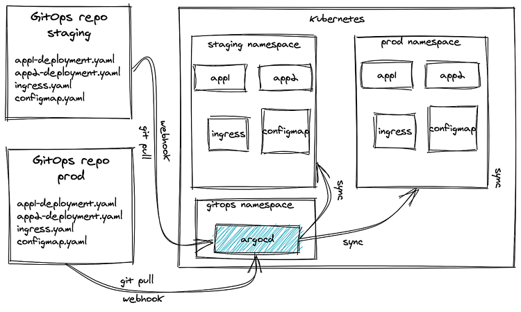
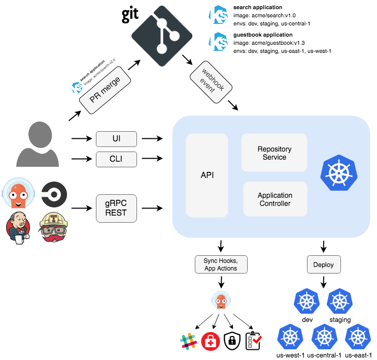

# POC ArgoCD
Example aplication for Argo CD

# GitOps 

La clave de GitOps es la idea de la infraestructura como código, que adopta el mismo enfoque de aprovisionamiento de la infraestructura que utiliza devops para aprovisionar las aplicaciones. 
Así, no solo la aplicación, sino también las máquinas y redes anfitrionas subyacentes, son descritas en archivos que pueden ser tratados como cualquier otro código dentro de un sistema de control de versiones, con procesos automatizados que trabajan para hacer converger la aplicación del mundo real con la descrita en esos archivos.

**WeaveWorks**: GitOps fue desarrollado por WeaveWorks, con el objetivo de crear una “fuente única” relacionada con la infraestructura y las aplicaciones.
Para ello se colocó a Git en el centro de su canal de entrega para que los desarrolladores puedan hacer uso de las solicitudes de extracción y así simplificar las operaciones y la implementación de software en Kubernetes.

## Pilares de GitOps

 - Infraestructura como código **(IaaC)**
 - Control de versiones **(Git)**
 - Colaboración **(Merge/Pull Request)**
 - Automatización **(CI/CD)**

## Beneficios y porque GitOps ?

* Unica fuente de la verdad (Estado deseado de la infraestructura en Git)
* Versionamiento de la infraestructura
* Rollback (Git revert)
* Colaboración entre equipos
* Mejora la seguridad - Solo el proceso de CD deberia tener permisos de modificación sobre los recursos del cluster
* Autodocumentación de Git

## Requisitos para implementar GitOps

* Herramienta de control de codigo fuente (Gitlab, Github, etc)
* Herramienta u operador de GitOps definido
* Flujo de proceso definido con actores

## Argo CD

* Diseñado para Kubernetes
* Interfaz de usuario web que proporciona una vista en tiempo real de la actividad de la aplicación
* Análisis del estado de salud de los recursos de la aplicación
* Capacidad para administrar e implementar en múltiples clústeres
* Soporte para múltiples herramientas de gestión de configuración / plantillas (Kustomize, Helm, Ksonnet, Jsonnet, plain-YAML)
* CLI para automatización e integración de CI
Integración de webhook (GitHub, BitBucket, GitLab)
* Métricas de Prometheus

## Modelo

## Arquitectura

## Prueba de Concepto

- Creación de Proyecto llamado Biometria
- Asignacion de permisos de Source repositories sobre el Proyecto
- Se asignó el repositorio donde se encuentran los templates de K8S
- Se creó una app llamada aplicacion1 y esta se asignó al proyecto Biometria (Se pueden crear mas aplicaciones dentro de un proyecto)

## Referencias:
[GitOps Definition](https://www.weave.works/blog/what-is-gitops-really)

[Argo CD](https://argo-cd.readthedocs.io/en/stable/)